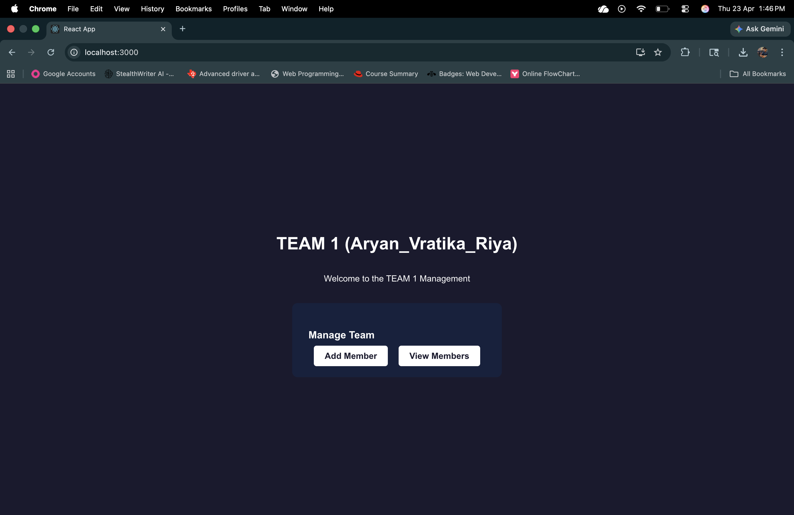
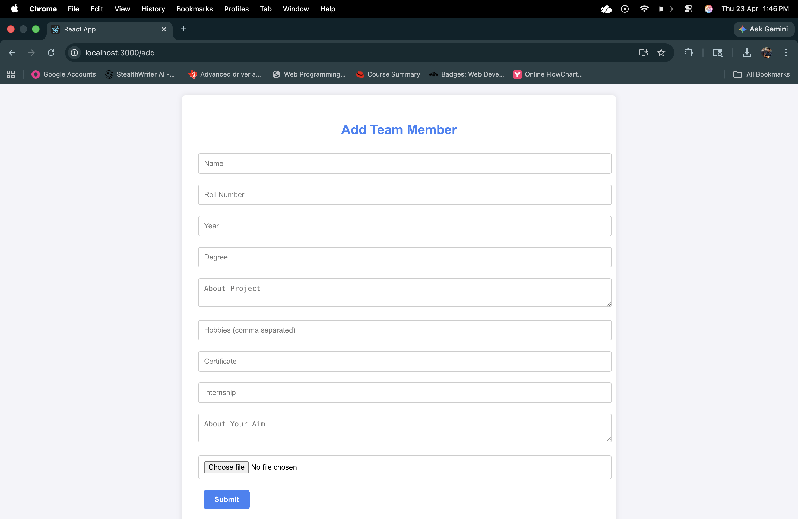
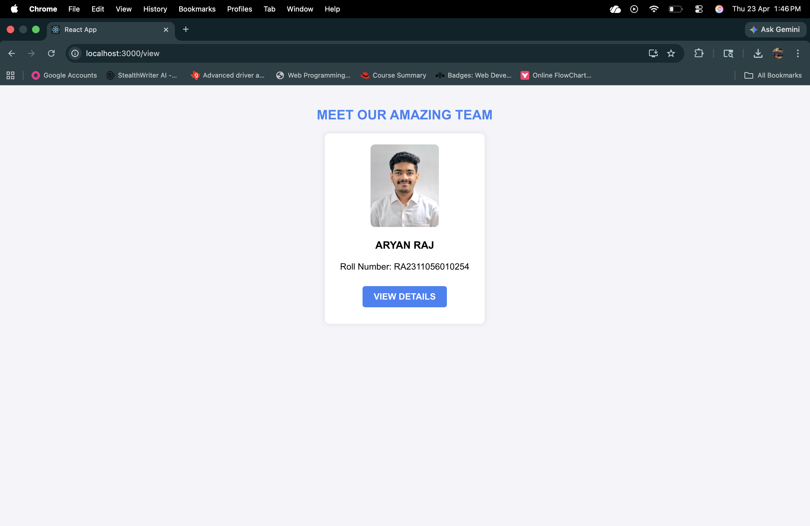
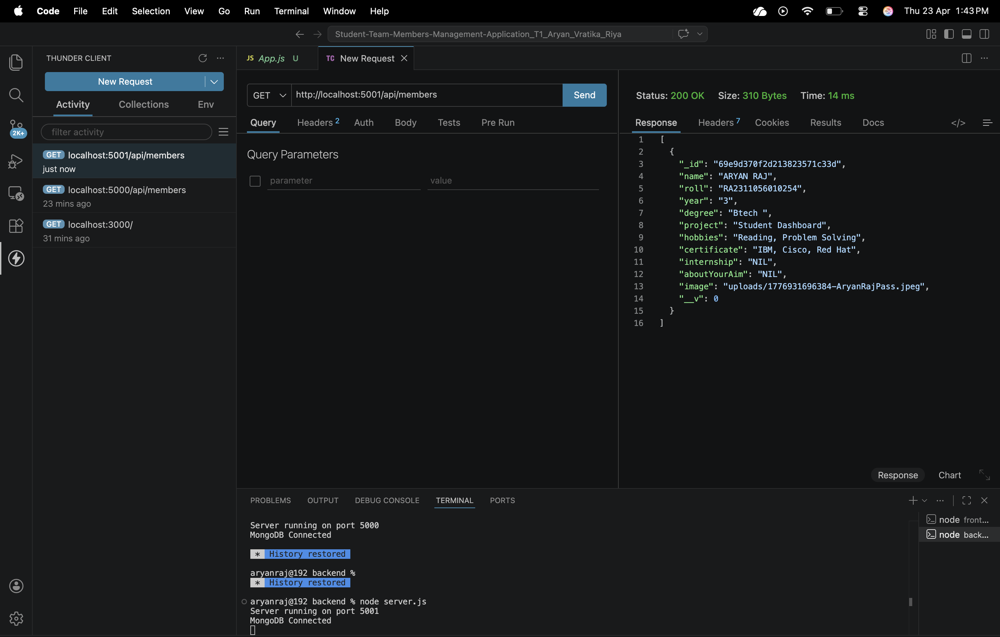
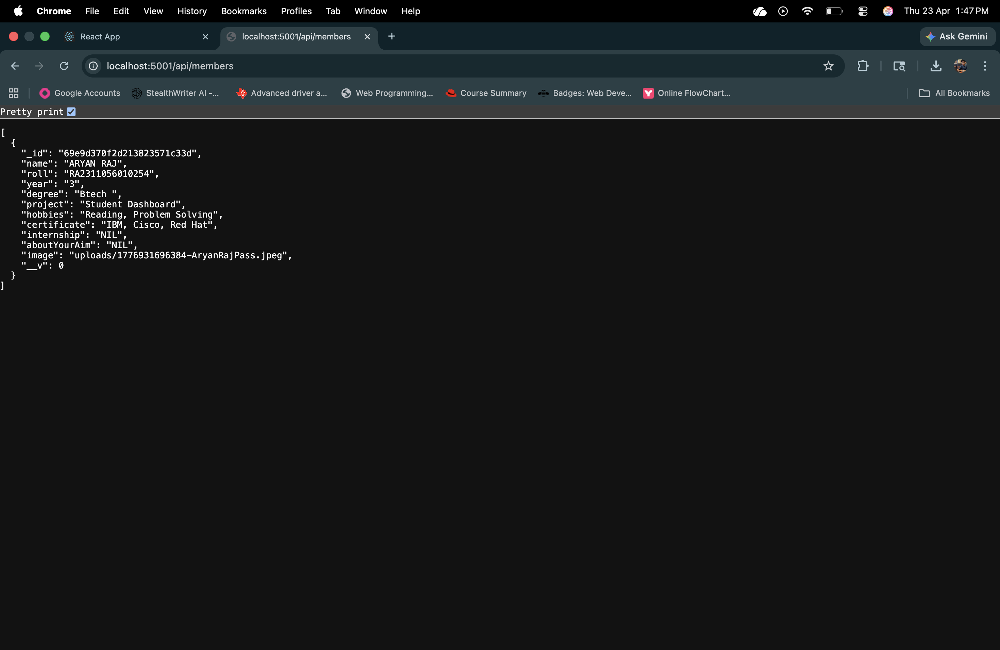

# Student Team Members Management Application

## 📖 Description
This is a full-stack web application built using the MERN stack (MongoDB, Express, React, Node.js) designed to manage student team members. The platform provides a user-friendly interface to efficiently view, add or update and manage details about team members for academic or extracurricular projects.

## 💻 Tech Stack
- **Frontend**: React, React Router Dom, Axios
- **Backend**: Node.js, Express, Mongoose, Multer (for file handling), CORS
- **Database**: MongoDB

## 📸 Project Screenshots

Here is a visual overview of the application:

### Dashboard


### Add Member


### View All Members


### Member Details View


### API View Member Details


## ⚙️ Installation Steps

1. **Clone the repository:**
   ```bash
   git clone https://github.com/aryanrajrcotba/Student-Team-Members-Management-Application_T1_Aryan_Vratika_Riya.git
   cd Student-Team-Members-Management-Application_T1_Aryan_Vratika_Riya
   ```

2. **Install Backend Dependencies:**
   ```bash
   cd backend
   npm install
   ```

3. **Install Frontend Dependencies:**
   ```bash
   cd ../frontend
   npm install
   ```

## 🚀 How to Run the App

1. **Ensure MongoDB is running locally** on your machine (default port `27017`).

2. **Start the Backend Server:**
   Open a terminal and navigate to the `backend` folder:
   ```bash
   cd backend
   node server.js
   ```
   *The backend will run on `http://localhost:5001`.*

3. **Start the Frontend Application:**
   Open a new terminal window and navigate to the `frontend` folder:
   ```bash
   cd frontend
   npm start
   ```
   *The frontend will open in your browser at `http://localhost:3000`.*

## 🔌 API Endpoints

The backend Express server provides the following RESTful API endpoints at `http://localhost:5001`:

- **`GET /api/members`**: Fetch a list of all team members.
- **`GET /api/members/:id`**: Fetch details of a specific team member by their ID.
- **`POST /api/members`**: Add a new team member (Accepts `multipart/form-data` for image uploads via Multer).
